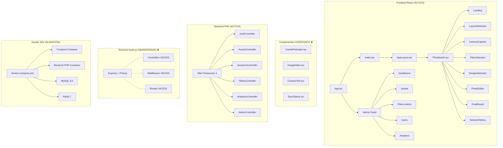
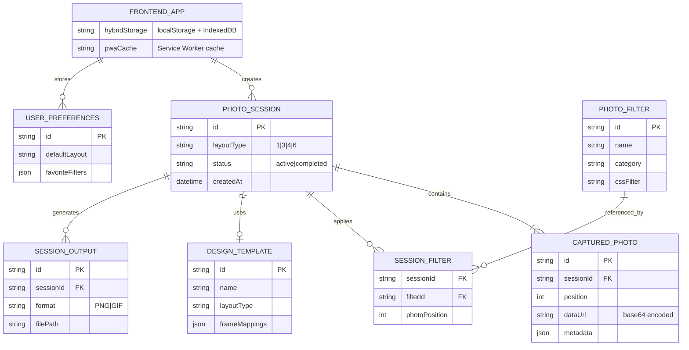

# 🔍 Code Audit Report - BoothieCall Elegancia

**Fecha:** Junio 25, 2026  
**Auditor:** Kiro AI  
**Objetivo:** Identificar código muerto, duplicaciones, archivos obsoletos y proponer un roadmap de limpieza

---

## 📊 Resumen Ejecutivo

| Categoría                        | Elementos Encontrados | Impacto                        |
| -------------------------------- | --------------------- | ------------------------------ |
| Componentes huérfanos            | 4                     | Medio - Confusión, bundle size |
| UI components no usados          | ~20                   | Alto - Bundle bloat            |
| Backend abandonado (Node.js)     | 1 carpeta completa    | Alto - Peso en repo            |
| Documentación obsoleta           | 5 archivos            | Medio - Confusión              |
| Archivos duplicados              | 8+                    | Medio - Mantenimiento          |
| Carpetas generadas sin gitignore | 5                     | Bajo - Peso en repo            |
| Archivos de otro proyecto        | 1 carpeta             | Medio - Confusión              |

---

## 🏗️ Diagrama de Arquitectura Actual



---

## 🗃️ Diagrama Entidad-Relación (Estado Actual)



---

## 🔴 Componentes Huérfanos (No Importados)

| Archivo                             | Razón de Existir          | Reemplazado Por                                  | Acción                                      |
| ----------------------------------- | ------------------------- | ------------------------------------------------ | ------------------------------------------- |
| `src/components/CachePreloader.tsx` | Precargar assets en cache | No se usa en ningún layout                       | **ELIMINAR**                                |
| `src/components/ImageEditor.tsx`    | Editor de fotos antiguo   | `PhotoEditor.tsx` (activo)                       | **ELIMINAR**                                |
| `src/components/CameraTest.tsx`     | Componente de prueba      | `CameraTestPage.tsx` usa `CameraCapture` directo | **ELIMINAR**                                |
| `src/components/SyncStatus.tsx`     | Mostrar estado de sync    | Exportado pero nunca consumido en UI             | **EVALUAR** - podría ser útil si se integra |

---

## 🟡 UI Components (shadcn/ui) - No Usados

Estos componentes fueron instalados por shadcn pero NO se importan en ningún archivo del proyecto:

| Componente      | Archivo                                 | Acción       |
| --------------- | --------------------------------------- | ------------ |
| Calendar        | `src/components/ui/calendar.tsx`        | **ELIMINAR** |
| Carousel        | `src/components/ui/carousel.tsx`        | **ELIMINAR** |
| Command         | `src/components/ui/command.tsx`         | **ELIMINAR** |
| Context Menu    | `src/components/ui/context-menu.tsx`    | **ELIMINAR** |
| Hover Card      | `src/components/ui/hover-card.tsx`      | **ELIMINAR** |
| Input OTP       | `src/components/ui/input-otp.tsx`       | **ELIMINAR** |
| Menubar         | `src/components/ui/menubar.tsx`         | **ELIMINAR** |
| Navigation Menu | `src/components/ui/navigation-menu.tsx` | **ELIMINAR** |
| Pagination      | `src/components/ui/pagination.tsx`      | **EVALUAR**  |
| Resizable       | `src/components/ui/resizable.tsx`       | **ELIMINAR** |
| Sidebar         | `src/components/ui/sidebar.tsx`         | **ELIMINAR** |
| Textarea        | `src/components/ui/textarea.tsx`        | **EVALUAR**  |

> Nota: Eliminar estos reduce el bundle size pero no afecta funcionalidad. Tree-shaking de Vite debería excluirlos del build, pero ocupan espacio en el repo.

---

## 🔴 Backend Node.js - COMPLETAMENTE ABANDONADO

```
backend/
├── docker/              # VACÍO
├── docs/                # 1 archivo (deployment duplicado)
├── node_modules/        # ~200MB de dependencias INÚTILES
├── prisma/schema.prisma # Schema definido pero nunca usado
├── src/
│   ├── config/config.ts # ÚNICO archivo con contenido
│   ├── controllers/     # VACÍO
│   ├── middleware/      # VACÍO
│   ├── models/          # VACÍO
│   ├── routes/          # VACÍO
│   ├── services/        # VACÍO
│   ├── types/           # VACÍO
│   ├── utils/           # VACÍO
│   └── index.ts         # Skeleton (importa módulos que no existen)
├── tests/               # VACÍO
├── docker-compose.yml   # Configuración para stack que no se construyó
└── package.json         # 30+ dependencias instaladas sin usar
```

**Veredicto:** ELIMINAR COMPLETAMENTE. El backend PHP (`backend-php/`) es el activo.

---

## 🟡 Documentación Obsoleta

| Archivo                            | Problema                                                     | Acción                             |
| ---------------------------------- | ------------------------------------------------------------ | ---------------------------------- |
| `docs/backend_architecture.md`     | Documenta backend Node.js abandonado                         | **ELIMINAR** o reescribir para PHP |
| `docs/supabase_schemas.sql`        | Supabase fue abandonado, se usa MySQL                        | **ELIMINAR**                       |
| `docs/implementation_plan.md`      | Referencia roadmap Node.js de 8 semanas que nunca se ejecutó | **ACTUALIZAR** o eliminar          |
| `roadmap-temp.md` (si aún existe)  | Duplicado temporal del roadmap                               | **ELIMINAR** (ya movido a docs/)   |
| `EFFICIENCY_REPORT.md` (si existe) | Reporte puntual, no mantenido                                | **ELIMINAR**                       |

---

## 🟡 Archivos Duplicados

| Original                                 | Duplicado                                       | Acción                                    |
| ---------------------------------------- | ----------------------------------------------- | ----------------------------------------- |
| `backend-php/docs/GODADDY_DEPLOYMENT.md` | `docs/GODADDY_DEPLOYMENT.md` + root (eliminado) | Mantener solo en `docs/`                  |
| `package-lock.json`                      | `yarn.lock`                                     | **ELIMINAR** yarn.lock (proyecto usa npm) |
| `PhotoEditor.tsx`                        | `ImageEditor.tsx`                               | Eliminar ImageEditor                      |
| `CameraCapture.tsx` (usado)              | `CameraTest.tsx` (huérfano)                     | Eliminar CameraTest                       |
| `src/hooks/use-toast.ts`                 | `src/components/ui/use-toast.ts`                | Verificar cuál se usa, eliminar duplicado |

---

## 🟡 Archivos de Otro Proyecto

```
flutter-boothiecall-context/    # Contexto para el repo Flutter
├── CLAUDE.md
├── PROMPT_NUEVA_SESION.md
└── steering/
    ├── project-context.md
    ├── coding-standards.md
    └── known-issues-and-gaps.md
```

**Veredicto:** Mover al repo Flutter o eliminar. No pertenece a este proyecto.

---

## 🟡 Carpetas Generadas (Deben estar en .gitignore)

| Carpeta                       | Propósito                  | En .gitignore? |
| ----------------------------- | -------------------------- | -------------- |
| `dist/`                       | Build output               | ❓ Verificar   |
| `coverage/`                   | Test coverage report       | ❓ Verificar   |
| `test-results/`               | Playwright results         | ❓ Verificar   |
| `playwright-report/`          | E2E report                 | ❓ Verificar   |
| `backend/node_modules/`       | Deps de backend abandonado | ❌ NO          |
| `backend-php/.phpunit.cache/` | PHPUnit cache              | ❓ Verificar   |

---

## 🟡 Archivos Raíz Innecesarios

| Archivo                | Propósito                   | Acción                              |
| ---------------------- | --------------------------- | ----------------------------------- |
| `test-basic.html`      | Test de deployment GoDaddy  | **ELIMINAR** (ya deployado)         |
| `test-permissions.php` | Test PHP en raíz            | **MOVER** a backend-php/ o eliminar |
| `generate-icons.sh`    | Script one-time para iconos | **MOVER** a scripts/                |
| `ripperFive.mdc`       | Reglas para otro AI tool    | **EVALUAR** - ¿sigue en uso?        |
| `.DS_Store`            | macOS artifact              | **ELIMINAR** + agregar a .gitignore |
| `LOCAL_SETUP.md`       | Guía local setup            | **MOVER** a docs/                   |

---

## 📦 Dependencias npm Posiblemente No Usadas

Verificar si estas dependencias se importan en algún archivo:

| Paquete                  | Propósito        | Sospecha                                 |
| ------------------------ | ---------------- | ---------------------------------------- |
| `embla-carousel-react`   | Carousel         | Si no se usa carousel UI → eliminar      |
| `cmdk`                   | Command palette  | Si no se usa command UI → eliminar       |
| `input-otp`              | OTP input        | Si no se usa OTP → eliminar              |
| `react-resizable-panels` | Resizable panels | Si no se usa resizable UI → eliminar     |
| `react-day-picker`       | Date picker      | Si no se usa calendar → eliminar         |
| `vaul`                   | Drawer           | Verificar uso                            |
| `next-themes`            | Theme switching  | Verificar si se usa vs custom theme      |
| `axios`                  | HTTP client      | ¿Se usa junto con @tanstack/react-query? |

---

## ✅ Roadmap de Limpieza (Waves)

### 🌊 Wave 1: Eliminación Segura - Zero Risk (1 hora)

Archivos que se pueden eliminar sin impactar NINGUNA funcionalidad:

```
ELIMINAR:
- [ ] backend/                          # Backend Node.js abandonado completo
- [ ] flutter-boothiecall-context/      # Contexto para otro repo
- [ ] src/components/ImageEditor.tsx    # Supersedido por PhotoEditor
- [ ] src/components/CameraTest.tsx     # Nunca importado
- [ ] src/components/CachePreloader.tsx # Nunca importado
- [ ] test-basic.html                   # Artifact de testing deployment
- [ ] test-permissions.php              # Artifact de testing
- [ ] yarn.lock                         # Duplicado (proyecto usa npm)
- [ ] .DS_Store                         # macOS artifact
- [ ] docs/supabase_schemas.sql         # Supabase abandonado
- [ ] docs/backend_architecture.md      # Documenta backend abandonado

MOVER:
- [ ] generate-icons.sh → scripts/
- [ ] LOCAL_SETUP.md → docs/
```

### 🌊 Wave 2: Limpieza UI Components (30 min)

Remover shadcn/ui components no usados (verificar imports primero):

```
VERIFICAR Y ELIMINAR SI NO IMPORTADOS:
- [ ] src/components/ui/calendar.tsx
- [ ] src/components/ui/carousel.tsx
- [ ] src/components/ui/command.tsx
- [ ] src/components/ui/context-menu.tsx
- [ ] src/components/ui/hover-card.tsx
- [ ] src/components/ui/input-otp.tsx
- [ ] src/components/ui/menubar.tsx
- [ ] src/components/ui/navigation-menu.tsx
- [ ] src/components/ui/resizable.tsx
- [ ] src/components/ui/sidebar.tsx
```

### 🌊 Wave 3: Limpieza de Dependencias npm (1 hora)

Remover packages no usados del `package.json`:

```
VERIFICAR Y ELIMINAR SI NO IMPORTADOS:
- [ ] embla-carousel-react
- [ ] cmdk
- [ ] input-otp
- [ ] react-resizable-panels
- [ ] react-day-picker
- [ ] vaul
- [ ] next-themes (si se usa custom theme)
- [ ] axios (si solo se usa @tanstack/react-query)

DESPUÉS:
- [ ] npm prune
- [ ] Verificar que build compila sin errores
- [ ] Verificar que tests pasan
```

### 🌊 Wave 4: Consolidación de Documentación (30 min)

```
ACTUALIZAR:
- [ ] docs/implementation_plan.md - Actualizar para reflejar PHP backend real
- [ ] Verificar que docs/api_specification.yaml matchea con backend-php/src/Routes/

EVALUAR:
- [ ] src/components/SyncStatus.tsx - ¿Integrar en UI o eliminar?
- [ ] ripperFive.mdc - ¿Sigue en uso?
- [ ] .clinerules/ - ¿Se usa? (byterover rules)
```

### 🌊 Wave 5: Optimización .gitignore (15 min)

```
AGREGAR A .gitignore:
- [ ] dist/
- [ ] coverage/
- [ ] test-results/
- [ ] playwright-report/
- [ ] .DS_Store
- [ ] *.log
- [ ] backend-php/.phpunit.cache/
- [ ] .env
- [ ] .env.local
```

---

## 📄 Documentos Creados/Agregados Recientemente

| Archivo                              | Creado En            | Relevancia Actual                    |
| ------------------------------------ | -------------------- | ------------------------------------ |
| `docs/DOCKER_SETUP.md`               | Esta sesión          | ✅ Relevante - Guía Docker activa    |
| `docs/DOCKER_ROADMAP.md`             | Esta sesión          | ✅ Relevante - Plan de dockerización |
| `docs/GOOGLE_ANALYTICS_ROADMAP.md`   | Esta sesión          | ✅ Relevante - Pendiente implementar |
| `flutter-boothiecall-context/`       | Esta sesión          | ⚠️ Mover al repo Flutter             |
| `.kiro/specs/docker-implementation/` | Esta sesión          | ✅ Relevante - Spec Docker           |
| `.kiro/specs/flutter-migration/`     | Esta sesión          | ⚠️ Mover al repo Flutter             |
| `.kiro/hooks/organize-docs.md`       | Esta sesión          | ⚠️ Ya ejecutado, puede eliminarse    |
| `scripts/docker-setup.sh`            | Esta sesión          | ✅ Relevante - Automatización Docker |
| `scripts/docker-reset.sh`            | Esta sesión          | ✅ Relevante - Reset Docker          |
| `scripts/docker-status.sh`           | Esta sesión          | ✅ Relevante - Monitoreo Docker      |
| `docker-compose.yml`                 | Esta sesión          | ✅ Relevante - Stack Docker activo   |
| `Dockerfile.frontend`                | Esta sesión          | ✅ Relevante - Build frontend        |
| `backend-php/Dockerfile`             | Esta sesión          | ✅ Relevante - Build backend         |
| `.env.docker`                        | Esta sesión          | ✅ Relevante - Config Docker         |
| `CHANGELOG.md`                       | Esta sesión (creado) | ✅ Relevante - Historial cambios     |

---

## 📊 Impacto Estimado de la Limpieza

| Métrica                    | Antes                                    | Después (estimado)                |
| -------------------------- | ---------------------------------------- | --------------------------------- |
| Archivos en repo           | ~500+                                    | ~400                              |
| Carpeta backend/ (Node.js) | ~200MB (con node_modules)                | 0                                 |
| Componentes huérfanos      | 4                                        | 0                                 |
| UI components no usados    | ~20                                      | ~5 (conservadores)                |
| Documentos obsoletos       | 5                                        | 0                                 |
| Lock files                 | 2                                        | 1                                 |
| Claridad del proyecto      | Confuso (2 backends, docs contradicting) | Claro (1 backend, docs alineados) |
