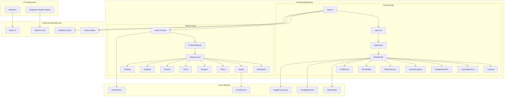
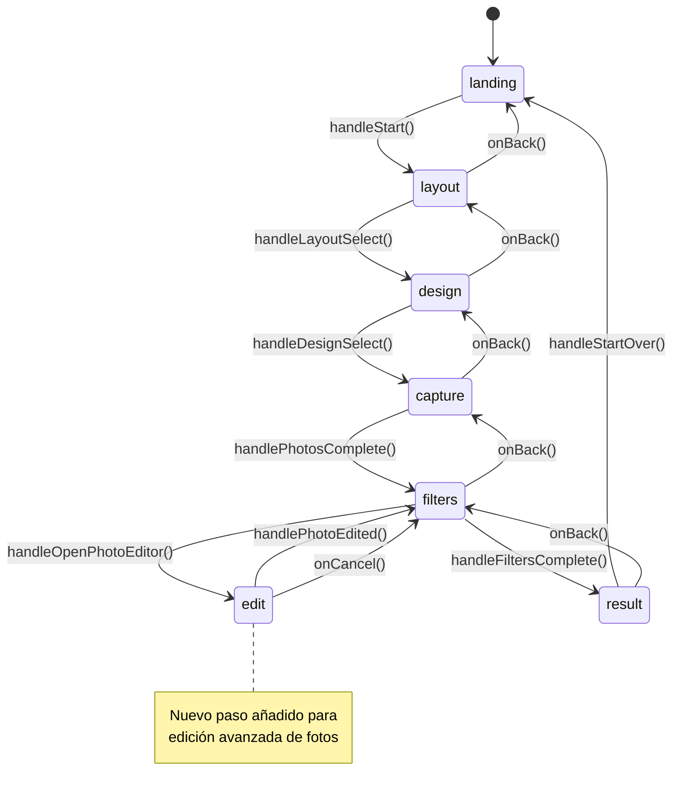
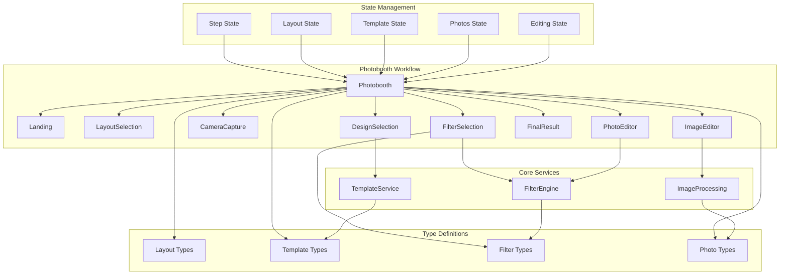
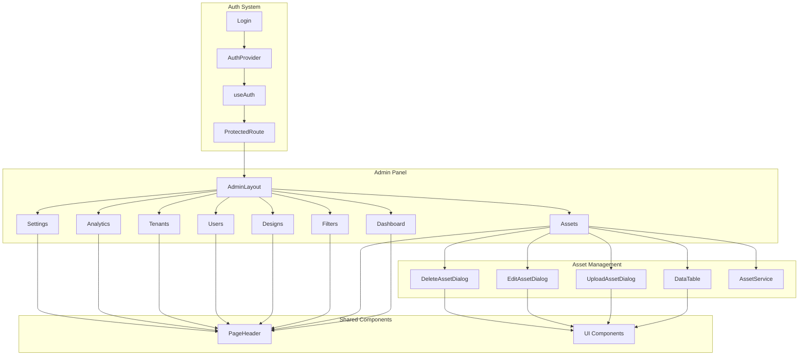
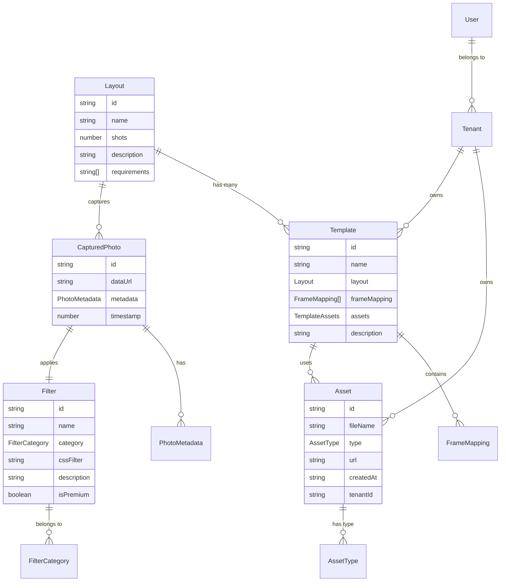
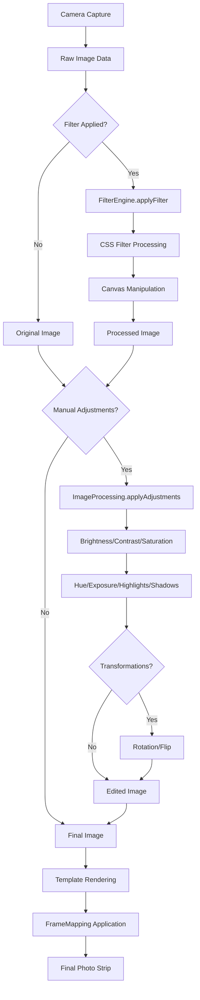
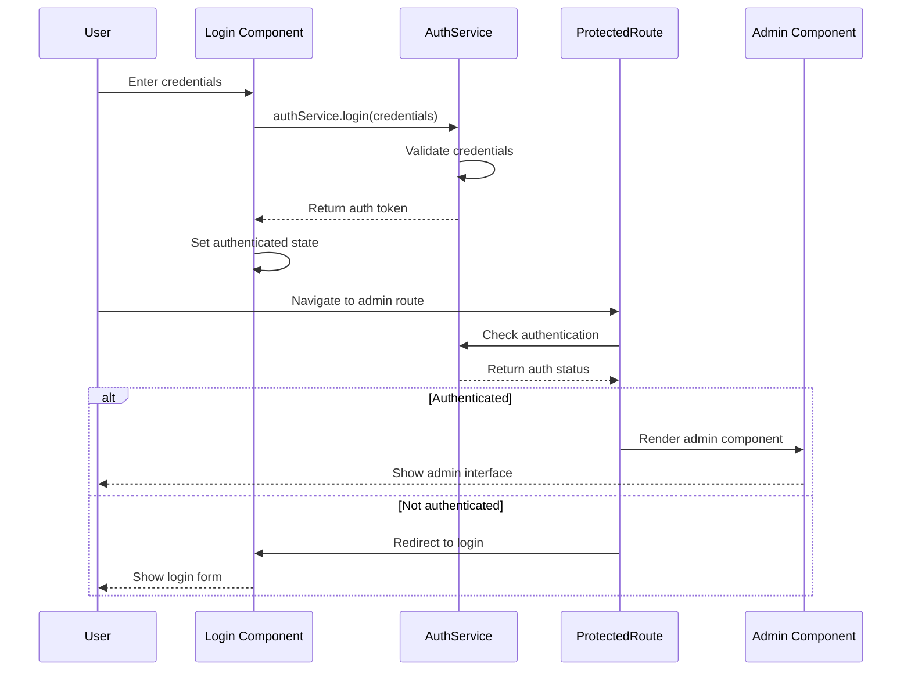
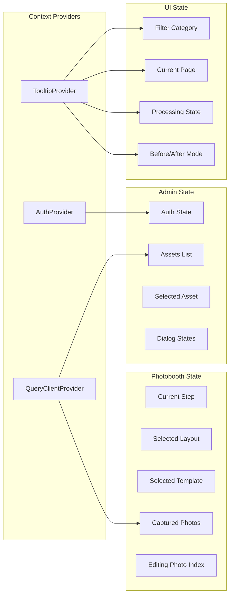

# BoothieCall Elegancia - Diagramas de Arquitectura

## 1. Arquitectura General del Sistema

## 2. Flujo de Workflow del Photobooth

## 3. Arquitectura de Componentes - Principal

## 4. Arquitectura de Componentes - Admin

## 5. Arquitectura de Datos

## 6. Flujo de Procesamiento de Imágenes

## 7. Sistema de Autenticación y Autorización

## 8. Gestión de Estados Global

## 9. Integración Admin-Principal

```mermaid
graph TB
    subgraph "Admin Panel (Content Management)"
        A[Asset Upload] --> B[Asset Storage]
        C[Template Creation] --> D[Template Storage]
        E[Filter Configuration] --> F[Filter Storage]
        G[User Management] --> H[User Storage]
    end
    
    subgraph "Principal App (Content Consumption)"
        I[Template Loading] --> J[TemplateService]
        K[Filter Application] --> L[FilterEngine]
        M[Photo Processing] --> N[ImageProcessing]
    end
    
    subgraph "Shared Resources"
        O[Asset Directory]
        P[Template Configs]
        Q[Filter Definitions]
    end
    
    B --> O
    D --> P
    F --> Q
    
    J --> P
    L --> Q
    N --> O
    
    style A fill:#f9d71c
    style C fill:#f9d71c
    style E fill:#f9d71c
    style G fill:#f9d71c
    style I fill:#27272a
    style K fill:#27272a
    style M fill:#27272a
```

