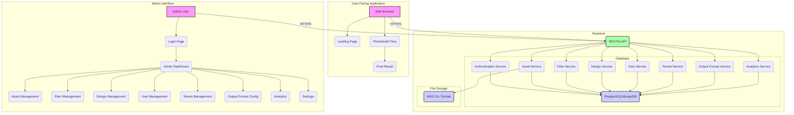

```mermaid
graph TD
    subgraph User-Facing Application
        UFA[Web Browser] --> UF1(Landing Page)
        UFA --> UF2(Photobooth Flow)
        UF2 --> UF3(Final Result)
    end

    subgraph Admin Interface
        ADM[Admin User] --> ADM1(Login Page)
        ADM1 --> ADM2(Admin Dashboard)
        ADM2 --> ADM3(Asset Management)
        ADM2 --> ADM4(Filter Management)
        ADM2 --> ADM5(Design Management)
        ADM2 --> ADM6(User Management)
        ADM2 --> ADM7(Tenant Management)
        ADM2 --> ADM8(Output Format Config)
        ADM2 --> ADM9(Analytics)
        ADM2 --> ADM10(Settings)
    end

    subgraph Backend
        API(RESTful API) --> B1(Authentication Service)
        API --> B2(Asset Service)
        API --> B3(Filter Service)
        API --> B4(Design Service)
        API --> B5(User Service)
        API --> B6(Tenant Service)
        API --> B7(Output Format Service)
        API --> B8(Analytics Service)

        subgraph Database
            DB(PostgreSQL/MongoDB)
            B1 --> DB
            B2 --> DB
            B3 --> DB
            B4 --> DB
            B5 --> DB
            B6 --> DB
            B7 --> DB
            B8 --> DB
        end

        subgraph File Storage
            FS(AWS S3 / Similar)
            B2 --> FS
        end
    end

    UFA -- HTTP/S --> API
    ADM -- HTTP/S --> API

    style UFA fill:#f9f,stroke:#333,stroke-width:2px
    style ADM fill:#f9f,stroke:#333,stroke-width:2px
    style API fill:#afa,stroke:#333,stroke-width:2px
    style DB fill:#ccf,stroke:#333,stroke-width:2px
    style FS fill:#ccf,stroke:#333,stroke-width:2px
```